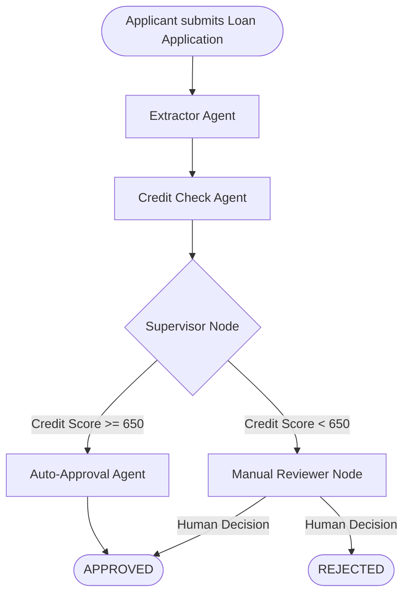
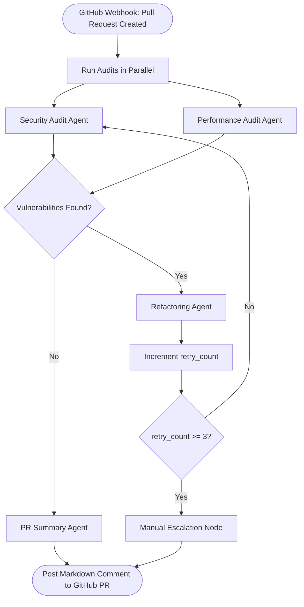
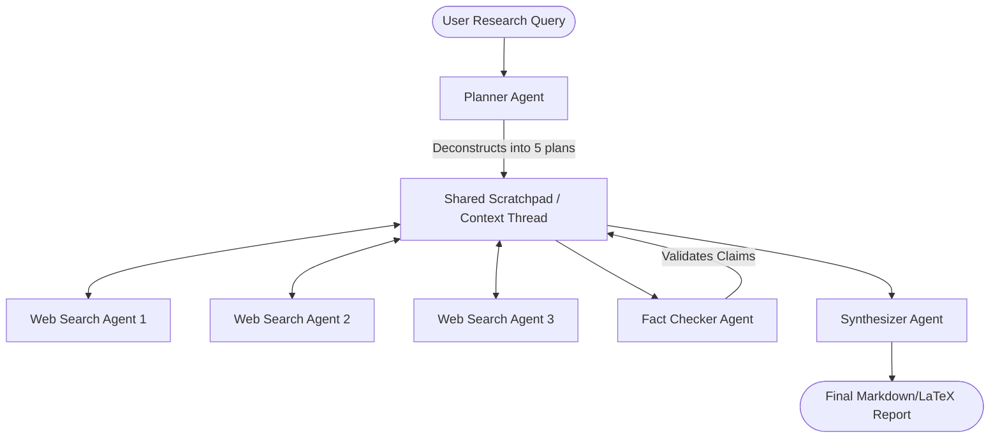
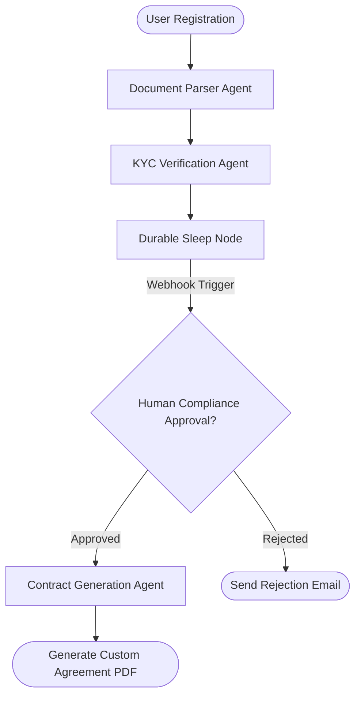

# Capstone Project Blueprints

This document outlines the four production-grade multi-agent capstone projects described in the *Agentic AI Complete Handbook*. 

---

## 1. Project Blueprint 1: Financial Loan Approval Pipeline
### Architecture Pattern: Hierarchical Supervisor + Dynamic Routing

* **Workflow Mechanics:**
  1. **Extractor Agent:** Receives unstructured loan applications (PDFs) and uses structured output parsing (e.g., Pydantic) to extract names, IDs, income, and requested loan amount into structured JSON.
  2. **Credit Check Agent:** Queries credit databases/APIs to evaluate the applicant's credit score and history.
  3. **Supervisor Node:** Evaluates the credit profile. If the credit score is $\ge 650$, it dynamically routes the execution to the `Auto-Approval Agent`. If the credit score is $< 650$, it routes the flow to the `Manual Reviewer Node`, pausing execution for human compliance verification.
* **Tech Stack:** LangGraph, Pydantic, PostgreSQL, FastAPI.

---

## 2. Project Blueprint 2: Autonomous CI/CD Code Security Audit & Refactoring Bot
### Architecture Pattern: Network State Graph with Infinite Loop Counter Guards

* **Workflow Mechanics:**
  1. **Trigger:** Activated via a GitHub Action Webhook when a developer creates a new Pull Request.
  2. **Parallel Audit:** The `Security Audit Agent` and `Performance Audit Agent` run in parallel to scan the code diff for security flaws (e.g., SQL injections, remote code execution) and performance bottlenecks.
  3. **Self-Correction Loop:** If vulnerabilities are found, the `Refactoring Agent` generates code fixes, updates the graph state, increments a `retry_count`, and loops back to the audit agents.
  4. **Loop Guard:** If `retry_count >= 3`, the loop stops and routes to a human reviewer node to prevent infinite ping-pong loops.
  5. **Reporting:** A `PR Summary Agent` compiles the results into a clean markdown table and posts it as a PR comment.
* **Tech Stack:** LangGraph, GitHub REST API, Semgrep, Python REPL, Docker.

---

## 3. Project Blueprint 3: Deep Research & Strategy Co-Editing System
### Architecture Pattern: Collaborative Shared Scratchpad + Supervisor Synthesis

* **Workflow Mechanics:**
  1. **Planner Agent:** Takes a broad research topic from a user and deconstructs it into 5 sub-topic research plans.
  2. **Web Search Agents:** Three concurrent web search agents fetch real-time search engine results and dump raw facts/summaries into a shared scratchpad message thread.
  3. **Fact Checker Agent:** Reads the shared scratchpad and validates statements against source URLs to filter out hallucinated content.
  4. **Synthesizer Agent:** Synthesizes the verified facts into a polished, comprehensive research paper/report in Markdown or LaTeX format.
* **Tech Stack:** CrewAI or LangGraph, Tavily Search API, Claude 3.5 Sonnet.

---

## 4. Project Blueprint 4: Enterprise Customer Onboarding & KYC Workflow
### Architecture Pattern: Temporal Durable Execution wrapping Multi-Agent Nodes

* **Workflow Mechanics:**
  1. **Document Parser Agent:** Extracts and validates passport/ID details from uploaded documents.
  2. **KYC Verification Agent:** Performs checks (blacklist search, address verification, database query).
  3. **Durable Wait Node:** Execution enters a durable sleep node (powered by Temporal) waiting for human compliance webhook approval (can sleep safely for days/weeks without losing state).
  4. **Contract Generation Agent:** Upon approval, it constructs a customized customer onboarding agreement and compiles it into a downloadable PDF format.
* **Tech Stack:** Temporal Python SDK, LangChain, WeasyPrint, Redis.
